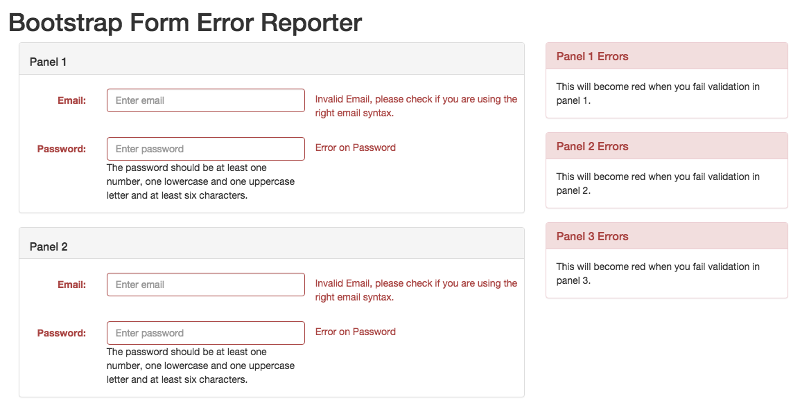

# Bootstrap Form Error Reporter

This plugin takes the validation responsibility from the application and puts a hook to validate form and fields using bootstrap css classes.


Installation:
------------

```
npm install bootstrap-form-error-reporter
```
or using package.json

```
{
  "name": "my-app",
  ..
  "devDependencies": {
    ..
    "bootstrap-form-error-reporter": "1.13.0"
  }
}
```
Then do `npm install`


Usage:
------

1. You can simply use it by providing a selector, validator and message.


```
var emailTester = function(val) {
    var re = /^([\w-]+(?:\.[\w-]+)*)@((?:[\w-]+\.)*\w[\w-]{0,66})\.([a-z]{2,6}(?:\.[a-z]{2})?)$/i;
    return re.test(val);
};

var passwordTester = function(val) {
    // at least one number, one lowercase and one uppercase letter
    // at least six characters
    var re = /(?=.*\d)(?=.*[a-z])(?=.*[A-Z]).{6,}/;
    return re.test(val);
};

var bfer = new BootstrapFormErrorReporter("#my-form");

bfer
    .initField('#email', emailTester, "Invalid %s, please check if you are using the right email syntax.")
    .initField('#password', passwordTester,"The %s should be at least one number, one lowercase and one uppercase letter and at least six characters.");

bfer.setFieldErrorMessage();

```

However, this displays a message on top of the form and makes the form jump.


2. So we have another solution in which we can display error by adding a highlight error class on respective element.
See below the screenshot shows panel boxes which become red when there is an error on the field.




```

//You specify the validators as in step 1

 ...

// Then instead of targeting the whole form you target a panel or group of fields container

var bfer = new BootstrapFormErrorReporter("#my-fields-container-panel", {
    highlightElement: ".scope1-highlight",
    highlightClass: "panel-danger"
});
bfer
            .initField('.email', emailTester, emailErrorMessage)
            .initField('.password', passwordTester);

```

For full working example see [example2](example/example2.html)


Advanced Usage:
----------------

You pass a field set and fieldset validator. It will use a reference field to validate the fields and display errors.

```
    var fieldSet = {
        'referenceField' : $('#pageBackground'),
        'compareWith': $('#pageText #pageLink #pageLinkHover').toArray() //Array of HTMLElements
    };
    var validateColorContrastFieldSet = function(fieldSet) {
        var ccc = new ColorContrastChecker();

        var field1 = fieldSet.referenceField;
        var colorA = field1.val(); //background
        var result = [];

        $.each(fieldSet.compareWith, function(i, field2) {
            var colorB = field2.val(); //text
            result.push(ccc.isLevelAA(colorA, colorB));
        });

        return result;
    };


    var errorMessage = "Insufficient contrast between this and %s.";
    var bfer = new BootstrapFormErrorReporter('#theme-form .col-xs-10');

    bfer.initFieldSet(
        fieldSet,
        validateColorContrastFieldSet,
        errorMessage
    );
```
